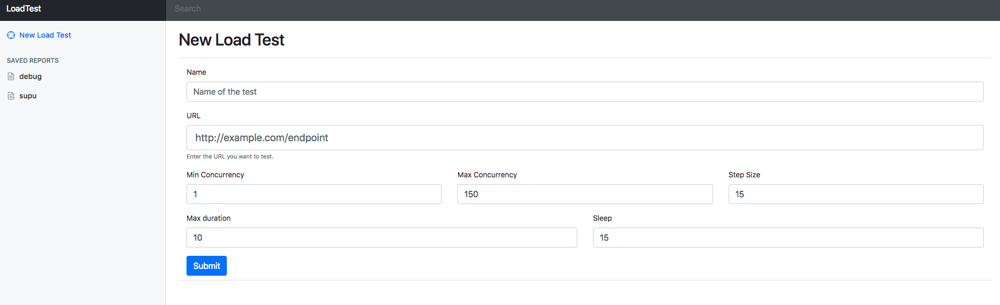
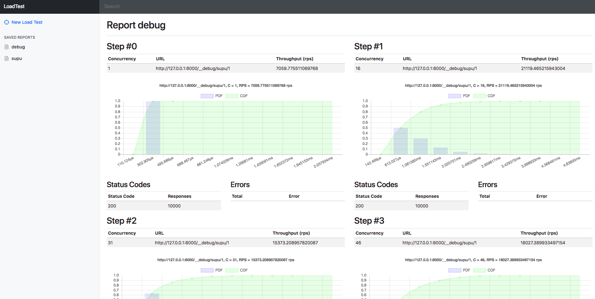
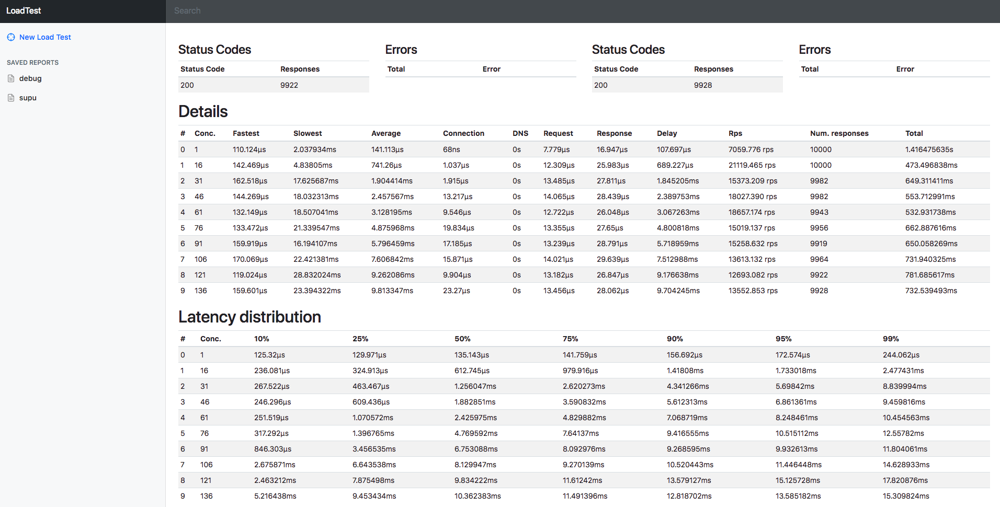

# load-test
HTTP Load testing web tool

### New load test



### Inspect test report





## Install

1. Clone the repo

```
go get github.com/kpacha/load-test
```

2. Install dependencies and build

```
cd $GOPATH/src/github.com/kpacha/load-test
make prepare all
```

3. Run

```
./load-test -h
Usage of ./load-test:
  -f string
    	path to use as store (default ".")
  -p int
    	port to expose the html ui (default 7879)
```

```
./load-test
```

And the web will be running at http://localhost:7879/